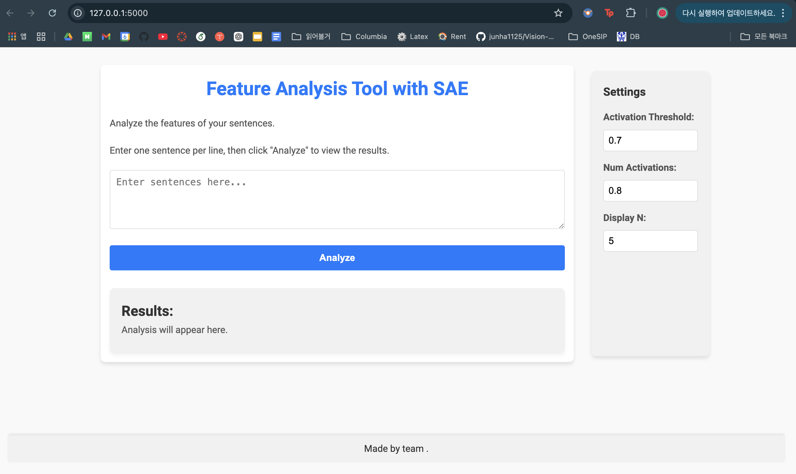
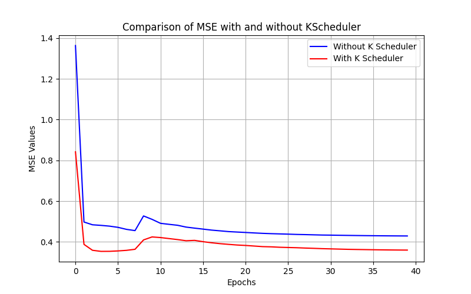
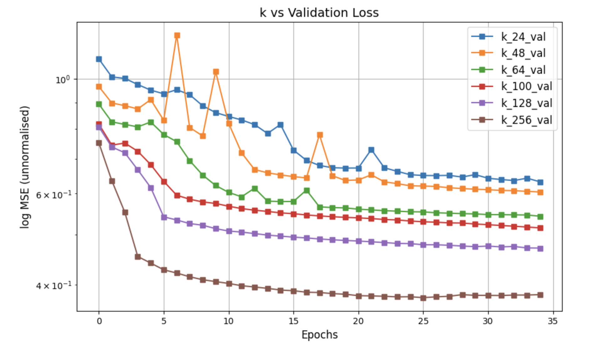

# LLM_interpretability

In this work we try to replicate the results of the Seminal works [Mapping the Mind of a Large Language Model](https://www.anthropic.com/research/mapping-mind-language-model) and [Scaling Monosemanticity](https://transformer-circuits.pub/2024/scaling-monosemanticity/) from Anthropic.

We demonstrate results using [MSFT Phi3 mini 128k Instruct](https://huggingface.co/microsoft/Phi-3-mini-128k-instruct) and [Mistral 7B](https://huggingface.co/mistralai/Mistral-7B-Instruct-v0.1)
| Model                               | Params      | MMLU average |
|-------------------------------------|-------------|--------------|
| MSFT Phi3 mini 128k Instruct  | 3.8B (2.2%) | 55.4         |
| Mistral 7B Instruct           | 7B (4%)     | 60.1         |
| Claude 3 Sonnet                     | 175B (100%) | 88.7         |


## Getting Started
### 1. Dataset Creation
First, you need to create a dataset of residual activations to train your SAE.<br>
Select model type between `Phi-3-mini-4k-instruct` or `Mistral-7B-Instruct-v0.2` and choose your text data.<br>
(The default setting lets you extract the residual stream from the 16th layer.)
```
python anthropicDataCreate.py
```

### 2. Train SAE
Once enough residual dataset is created, train SparseAutoEncoder with the data.<br>
Configure `DATASET_PATH` to the path of your dataset.<br>
For phi, set `INPUT_DIM=3072, HIDDEN_DIM_MULT=4`<br>
For mistral, set `INPUT_DIM=4096, HIDDEN_DIM_MULT=100`<br>
Sample training scripts are located under `run` folder

```
bash run/kSearch_phi.sh
bash run/kSearch_mistral.sh
```

### 3. Interpret SAE representation
#### [SAE Model Checkpoints](https://drive.google.com/drive/folders/1rWP7qHyvks7Bnl_1ibQSc2xzdmERhGPW?usp=sharing)
With SAE checkpoints ready, now you can run a flask web server to visualize activations and interact.
```
python server.py
# The server should run at 127.0.0.1:5000 by default
```



# Results
## TopK SAE Results

Unlike normal SAE, TopK SAE directly controls the sparsity of activations, removing the need for $L1$ regularization. This eliminates challenges like activation collapse (dead neurons), ensuring stable training.

We performed two key experiments on our phi-SAE:
1. Testing various values of K.
2. Evaluating the impact of K Scheduler on training.

### 1. K Scheduler Results
<p align="center">
  
</p>


| Method                  | Dead Neurons |
|-------------------------|--------------|
| **With K scheduling**   | 15400        |
| **Without K scheduling**| 27997        |

Using K scheduling significantly reduces the number of dead neurons, ensuring better utilization of the network’s capacity.


---

### 2. K vs Validation Loss
We also compared the validation loss for different K values:


<p align="center">
  
</p>

Smaller K values like 24, 48 exhibited higher validation losses, while larger K values stabilized faster and achieve lower overall losses. 
